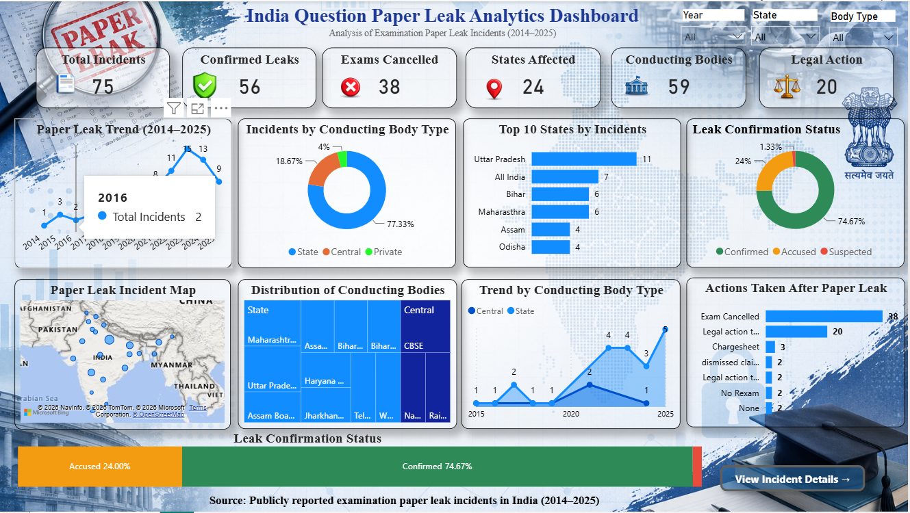
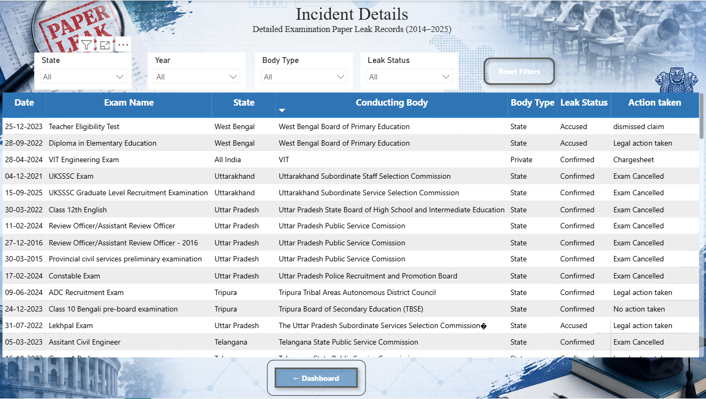

# India Question Paper Leak Analytics Dashboard | Power BI

## Project Overview

The India Question Paper Leak Analytics Dashboard is an interactive Power BI project designed to analyze examination paper leak incidents reported across India between 2014 and 2025. The dashboard consolidates incident data from multiple examinations and conducting bodies into a single interactive report, making it easier to identify trends, compare regions, and understand the impact of paper leak incidents.

The dashboard provides decision-makers with a comprehensive view of examination paper leak cases, helping users analyze affected states, conducting bodies, leak confirmation status, and the actions taken after each incident.

---

## Client Brief

Education authorities and examination conducting bodies require a centralized reporting solution to monitor paper leak incidents across different examinations and states. Existing records are often scattered across multiple sources, making it difficult to identify trends, evaluate the impact of incidents, and understand how different organizations respond to paper leaks.

The client requires an interactive dashboard that provides a clear overview of examination paper leak incidents, enabling users to analyze incident trends, compare conducting bodies, identify affected regions, and review the actions taken after each case.

---

## Problem Statement

Question paper leaks have become a major concern in competitive examinations and public recruitment processes. These incidents affect examination integrity, delay recruitment and admissions, and reduce public trust in examination systems.

Analyzing paper leak incidents from multiple years can be challenging without a centralized reporting system. This project addresses that challenge by developing an interactive Power BI dashboard that transforms raw incident data into meaningful insights, helping users monitor trends, identify high-risk regions, and understand how examination authorities respond to paper leak cases.

---

## Project Objective

The objective of this project is to develop an interactive Power BI dashboard that enables users to analyze examination paper leak incidents through dynamic visualizations and interactive filtering.

The dashboard is designed to simplify incident reporting, improve data accessibility, and provide meaningful insights that support informed decision-making.

---

## Business Goals

- Monitor examination paper leak incidents across India.
- Track yearly trends in paper leak cases.
- Identify states with the highest number of reported incidents.
- Compare different examination conducting bodies.
- Analyze paper leak confirmation status.
- Evaluate actions taken after reported incidents.
- Enable users to explore incident data through interactive filters.
- Support better reporting and decision-making using data.

---

## Dataset Overview

The project uses a dataset containing publicly reported examination paper leak incidents in India between 2014 and 2025.

The dataset includes information such as:

- Examination Name
- Incident Date
- State
- Conducting Body
- Conducting Body Type
- Leak Confirmation Status
- Action Taken
- Year
- Incident Location

The data was cleaned and transformed before being used to create the dashboard.

---

## Dashboard Features

### Dashboard 1 – India Question Paper Leak Analytics

- Total Incidents KPI
- Confirmed Leaks KPI
- Exams Cancelled KPI
- States Affected KPI
- Conducting Bodies KPI
- Legal Action KPI
- Paper Leak Trend (2014–2025)
- Conducting Body Type Distribution
- Top States by Incidents
- Leak Confirmation Status
- Paper Leak Incident Map
- Distribution of Conducting Bodies
- Trend by Conducting Body Type
- Actions Taken After Paper Leak
- Interactive Filters
  - Year
  - State
  - Conducting Body Type

### Dashboard 2 – Incident Details

- Detailed Incident Records
- Filter by State
- Filter by Year
- Filter by Conducting Body Type
- Filter by Leak Status
- Reset Filters Button
- Dashboard Navigation Button

---

## Dashboard Navigation

Dashboard Overview

↓

View Incident Details

↓

Detailed Incident Records

↓

Back to Dashboard

---

## Tools Used

- Power BI
- Power Query
- DAX
- Microsoft Excel

---

## Skills Applied

- Data Cleaning
- Data Transformation
- Data Modeling
- DAX Measures
- Calculated Columns
- Data Visualization
- Dashboard Design
- Interactive Reporting
- Business Analytics
- Data Storytelling

---

## Key Insights

- Paper leak incidents increased significantly after 2021.
- A small number of states account for a large share of reported incidents.
- State-level conducting bodies reported the highest number of paper leak cases.
- Most reported incidents were confirmed after investigation.
- Exam cancellation was the most common action taken following confirmed paper leak incidents.
- Interactive filters allow users to analyze incidents by year, state, and conducting body type.

---

## Challenges Faced

- Collecting and organizing publicly reported incident data from multiple sources.
- Cleaning inconsistent records and standardizing categorical values.
- Designing a dashboard that presents multiple insights without overwhelming the user.
- Creating meaningful DAX measures for KPI calculations.
- Building seamless navigation between dashboard pages.

---

## Areas for Improvement

- Integrate real-time data from official examination authorities.
- Include district-level analysis for deeper geographic insights.
- Add predictive analysis to identify high-risk examinations.
- Expand the dashboard to include examination schedules and affected candidate statistics.
- Implement row-level security for organization-specific reporting.

---

## Project Files

This repository includes:

- Power BI Dashboard (.pbix)
- Dataset
- Dashboard Screenshots
- Project Documentation

---

## Data Source

The dataset is based on publicly reported examination paper leak incidents in India between 2014 and 2025. It is intended for educational purposes and dashboard development.

---

## Dashboard Preview

### Dashboard 1 – India Question Paper Leak Analytics

### Dashboard 2 – Incident Details

## Author

Harshavardhan Gorre
